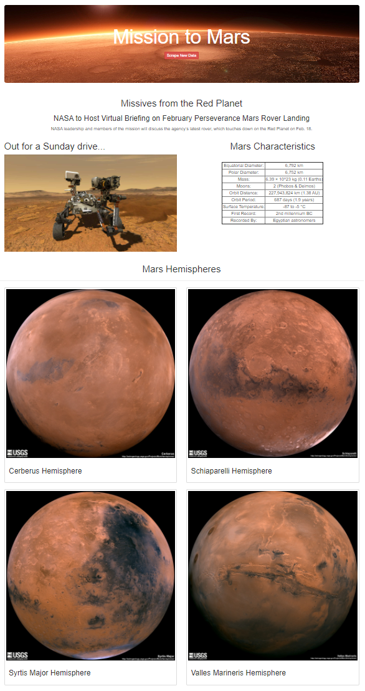

             
Project begins with initial scraping using Jupyter Notebook, BeautifulSoup, Pandas, and Requests/Splinter from public websites: 
<ul>
    <li> https://space-facts.com/mars<li>
    <li> https://mars.nasa.gov/news<li>
    <li> https://astrogeology.usgs.gov<li>
</ul>
 
1. The Jupyter Notebook contains the scraping code and the dictionary of information is saved as a Mongo database.  
2. The Jupyter Notebook is then converted to a python file for use in a Flask app. 
3. The Flask app has two routes- one for scraping new data from NASA and the other to redirect to the HTML home page code. 
 
The code is run as a Python file with this result: 

 

